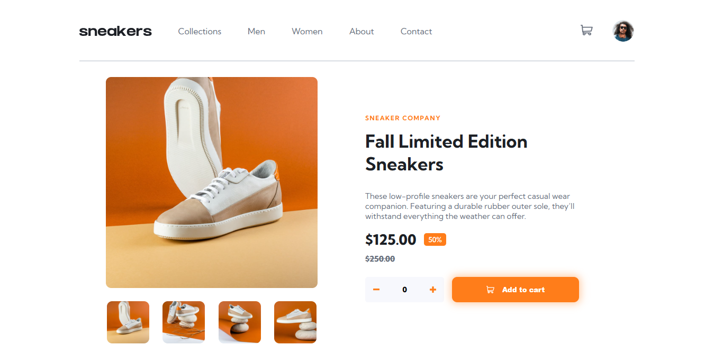
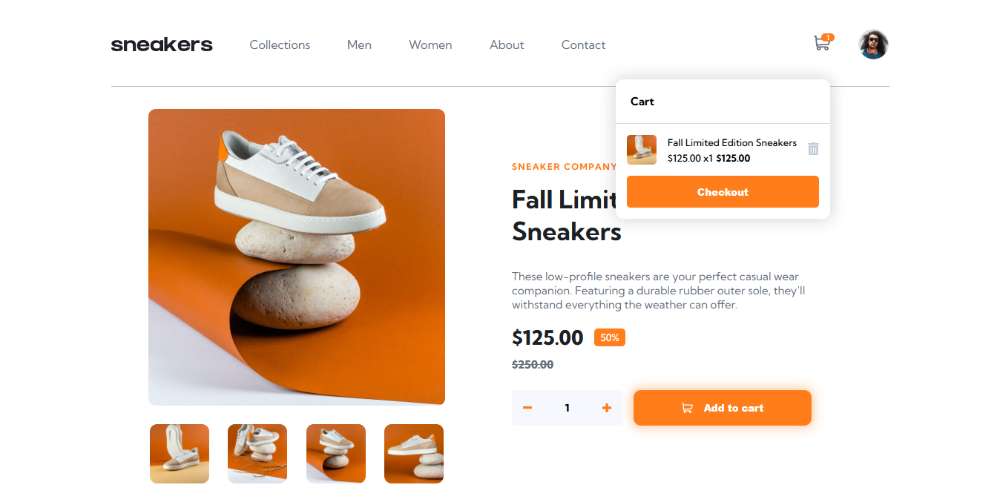

# E-commerce Product Page

## Sumário:

- [Visão Geral](#visão-geral)
  - [Sobre o Desafio](#sobre-o-desafio)
  - [Links](#links)
- [Sobre o Processo](#sobre-o-processo)
  - [Tecnologias Utilizadas](#tecnologias-utilizadas)
  - [O que eu aprendi](#o-que-eu-aprendi)
  - [O que preciso focar mais](#o-que-preciso-focar-mais)

## Visão Geral

### Sobre o Projeto

O E-commerce Product Page é um projeto desenvolvido a partir do design disponibilizado pelo site Frontend Mentor. Construído do zero para fins de estudo, o projeto permite que o usuário adicione produtos ao carrinho, definindo a quantidade desejada. Além disso, ao clicar na imagem principal, uma lightbox é exibida, possibilitando a visualização do produto em dimensões ampliadas. A página também é totalmente responsiva, garantindo uma experiência otimizada em dispositivos móveis.

Os usuários devem ser capazes de:

- Alternar entre as imagens do produto para melhor visualização na dimensão padrão ✅
- Visualizar o produto em dimensões maiores por meio da lightbox ✅
- Alternar entre as imagens da lightbox, por meio das setas e das imagens em miniatura ✅
- Definir a quantidade desejada do produto ✅
- Adicionar o produto ao carrinho ✅
- Deletar o produto do carrinho ✅
- Visualizar o valor final do produto de acordo com a quantidade selecionada ✅
- Utilizar a página de maneira otimizada em dispositivos móveis ✅

### Links

- 
Preview:

## Sobre o Processo

Confira nessa sessão quais foram as tecnologias e conceitos mais utilizados nesse desafio:

### Tecnologias utilizadas

&nbsp;

- <b>HTML</b>: linguagem de marcação usada para estruturar o conteúdo e elementos de páginas web.
- <b>CSS</b>: linguagem de estilo utilizada para definir o design, layout e aparência visual de páginas web.
- <b>JavaScript</b>: linguagem de programação responsável por adicionar interatividade e funcionalidades dinâmicas às páginas web.

### O que eu aprendi?

  Nesse projeto eu procurei praticar HTML, JavaScript e CSS puros, com o objetivo de fortalecer a minha base na programação, tendo um melhor desenvolvimento no aprendizado de novas ferramentas e frameworks.

### O que preciso focar mais?

  Irei implementar o conhecimento de lógica adquirido por meio da prática de HTML, JavaScript e CSS puros no aprendizado de novas ferramentas e frameworks, como React e NodeJs.